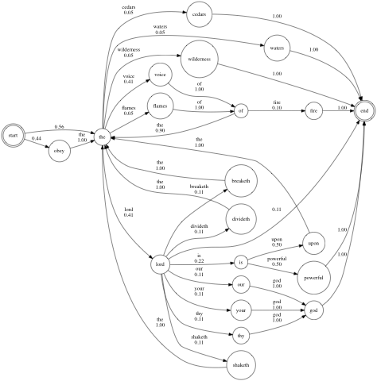

Project 0: Markov Babbler
-----------------------------

 Andrey Markov (Андре́й Ма́рков, 1856-1922), for whom [Markov Chains](https://en.wikipedia.org/wiki/Markov_chain) and Markov Processes are named.

Version 1.000

TODO: Finish writing this up
Only edit in master so that we can merge!

* * *

### Table of Contents

*   [Introduction](#Introduction)
*   [Welcome](#Welcome)
*   [Part 1](#P1)
*   [Test cases](#Testing)

TODO: Put the data for download into Google Drive (books.zip)
Questions to answer about the books (number of states, line stoppers, why that is happening)

### Introduction

Our goal is to write a program that generates random sentences that kind of sound like an author or authors that we trained our program on. For example, we may want to train our program on Lewis Carroll's _Alice in Wonderland_, and then generate sentences that kind of sound like Lewis Carroll. How should we do this?

One very simple approach (and the approach we will us here) is a [Markov Chain](https://en.wikipedia.org/wiki/Markov_chain). A Markov Chain is a state diagram that has probabilities attached to each transition between states.

I grabbed some books from Python's Natural Language Toolkit ([NLTK](https://www.nltk.org/)) package, which in turn gave me access to a variety of public domain texts from Project Gutenberg, which included _Moby Dick_, a complete version of the King James Bible, and several novels from GK Chesterton. I looked for sentences that started with "the X of the", since I figured that phrase shows up in multiple places (it does), and then found a lot of phrases from the King James Bible that contained "the voice of the". Here are those phrases:

    the voice of the lord breaketh the cedars
    the voice of the lord divideth the flames of fire
    the voice of the lord is powerful
    the voice of the lord is upon the waters
    the voice of the lord shaketh the wilderness
    obey the voice of the lord
    obey the voice of the lord your god
    obey the voice of the lord thy god
    obey the voice of the lord our god

Now, only some words can start a phrase, but each word is not equally likely to start a phrase. Similarly, each word is not equally likely to follow any other word. In fact, if we were to analyze this data, we could produce a really intersting probabilistic state diagram, or Markov Chain:

This is great! But, it's a very, very simple model of language, because the meaning of a word (at least in English) depends on its *context*, or the words that occur around it. We can get a slightly more accurate model of how words fit together if we instead consider n-grams, or sequences of *n consecutive words*. For example, for bigrams (i.e. where n=2), our Markov Chain looks like this:

TODO: bigram diagram

And if we look at trigrams (i.e. where n=3) we have this:

TODO: trigram diagram

TODO: non-biblical sources and song lyrics

TODO: link to the source file

TODO: test case, and test case diagram

TODO: running the Python test cases (may need a run.py in here)

TODO: hints on what should be your keys and values, and helper functions that are worth writing. Also, use string slicing as much as possible

TODO: where to download texts, generate and submit your best sentences

TODO: links to other Markov examples, including SongWriterBot https://saisenberg.com/projects/songwriterbot.html http://songwriterbot.herokuapp.com/about

What is a Markov process?
Visual of a state diagram
Example with some text
Possibly some helpful text
Link to some decent videos

### Welcome

### Code

### Other sections
